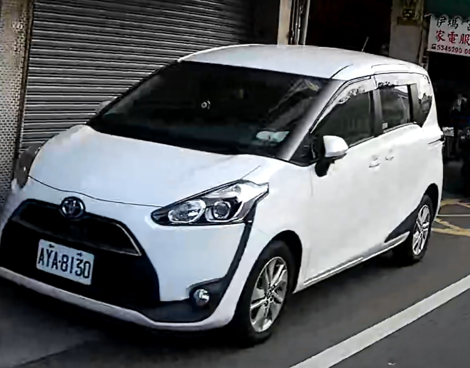

# Change Car Plate 

Open Code : [Car_Plate.ipynb](Car_Plate) 

* opencv 4
* python 3.5
* matplotlib

### Task 1 : Rotated Car Plate
original photo :  
  
output photo :  
  

### Step2 : Change Car Plate to another one
original photo :  
  
output photo :  
  

### Step3 : Plate Recognize
(in Progressing...)
