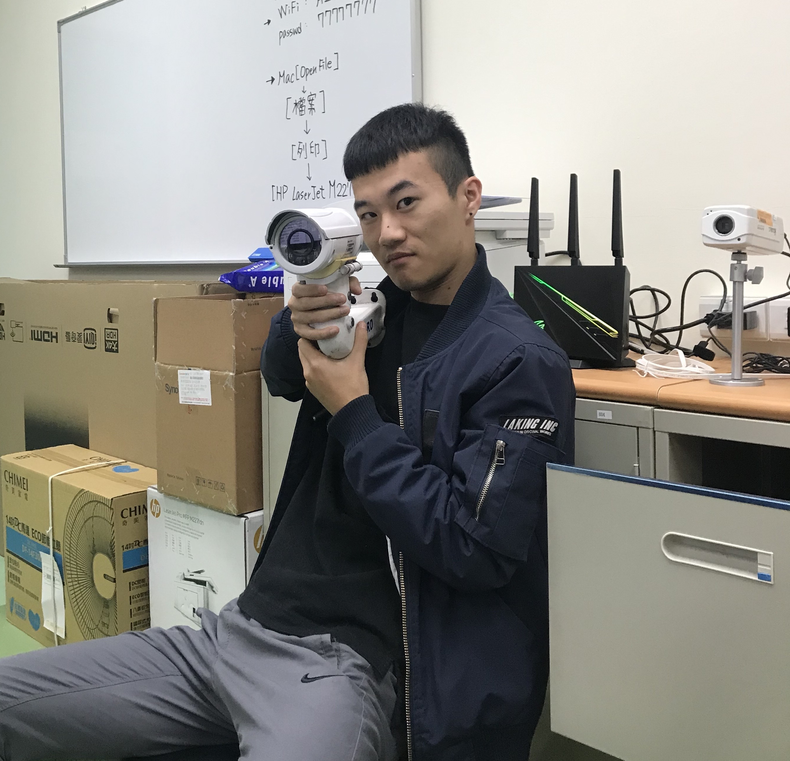

# Mosaicpy Photo by many photos
Let a original photo transfer to a mosaicpy photo by other photos.

### Step 1 : scratch factor photo
For scratch picture Use : [scratch_Taninan_photo.ipynb](scratch_Taninan_photo.ipynb)  
* flickrapi  
(reference https://github.com/ultralytics/flickr_scraper?fbclid=IwAR24AyioC562EutqUuAvkZiPuC0fc7fxB1Em3QE7Kv8iNZVKXgfCkfdsH-M )

### Step2 : Create a mosaicpy photo
For create mosaicpy photo Use : [main1_original.ipynb](main1_original.ipynb)  
* opencv
* numpy
* matplotlib
<a/>

original photo :  
  
output photo :  
  

### Step2* : can choose factor image (background photo)size & addWeight ratio
Then you can have a clear factor photo version.  
output2 photo : [main2_controlsize.ipynb](main2_controlsize.ipynb)  
  
