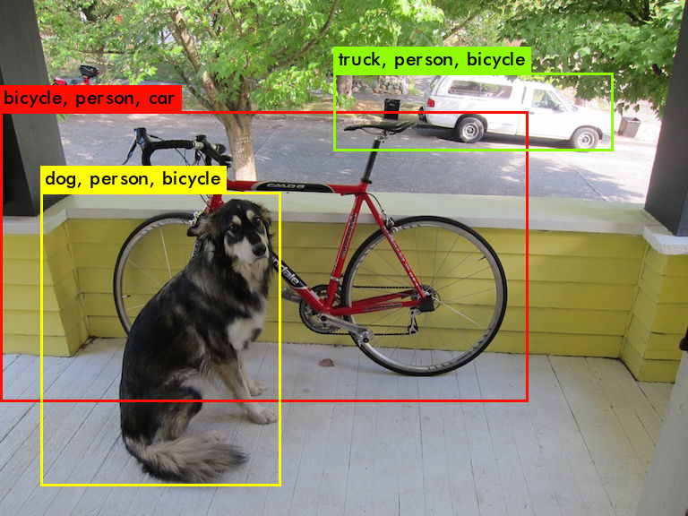

# Change yolo code homework:

### work1
* Change the bbox's title : output not only predict class also second & third titles
* Change the bbox range.
</a>

Original photo :  
  

Output photos:  
     

Example Code [Here](image.c) (change the .c file in yolo)  
Yolo official Reference : https://pjreddie.com/darknet/yolo/  

### work2
* Modify the yolo model for faster yolov3 model
Original speed :  
  

New speed :  
  

Reference Code :  
  

  
